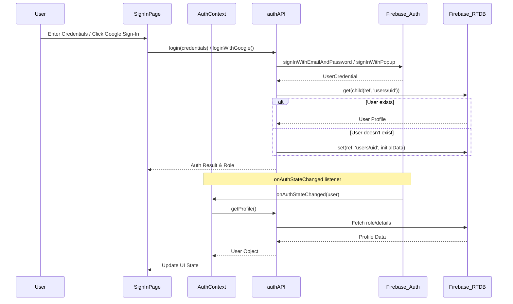
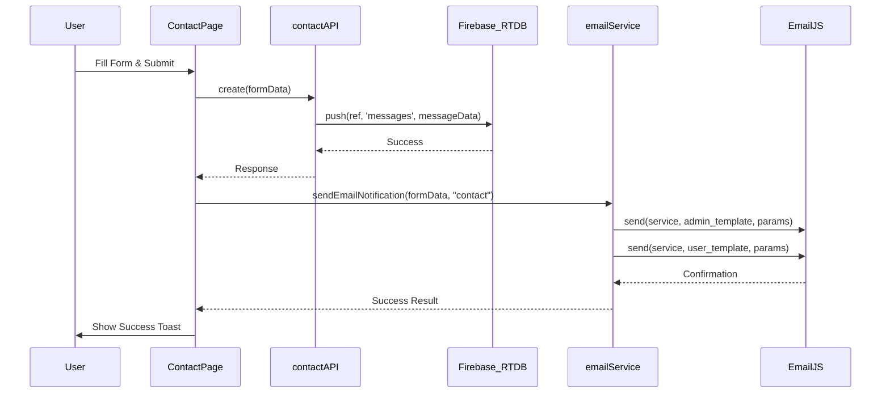
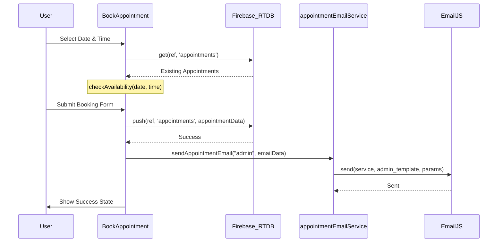

# Project Sequence Diagrams

This document outlines the key interaction flows within the TechTide project using Mermaid sequence diagrams.

## 1. Authentication Flow

This diagram illustrates the process when a user signs in using email/password or Google.

## 2. Contact Form Submission

This flow describes how a visitor submits a contact inquiry.

## 3. Appointment Booking

This flow details the appointment scheduling process, including availability check.

