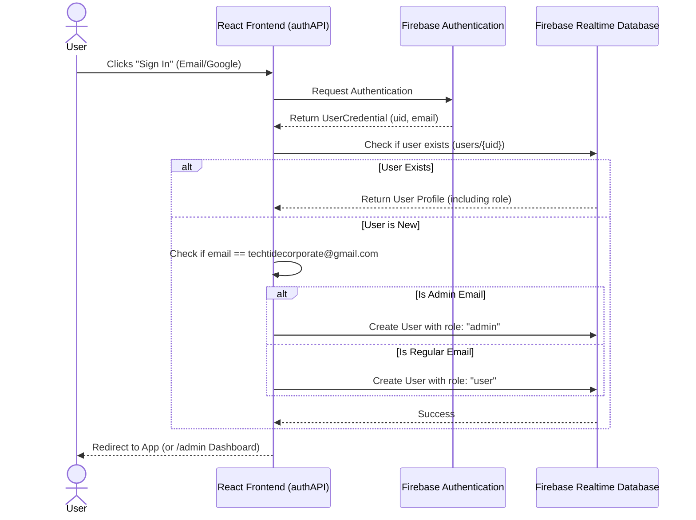
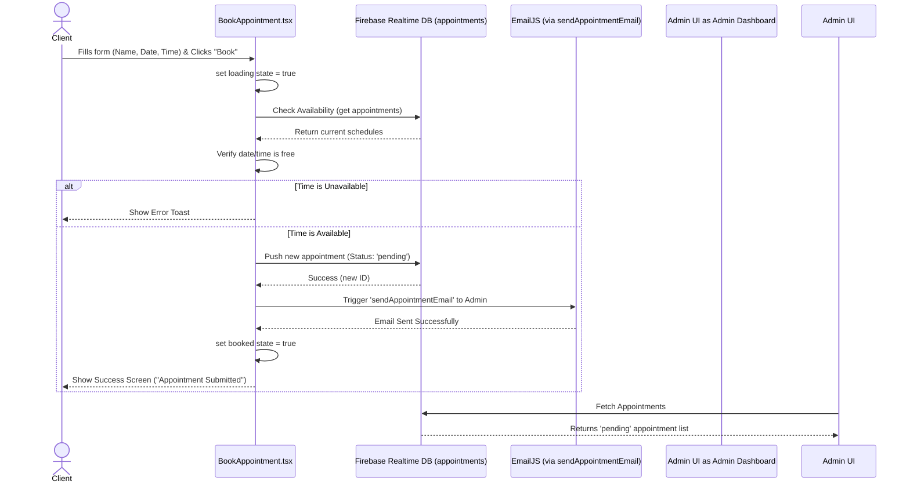
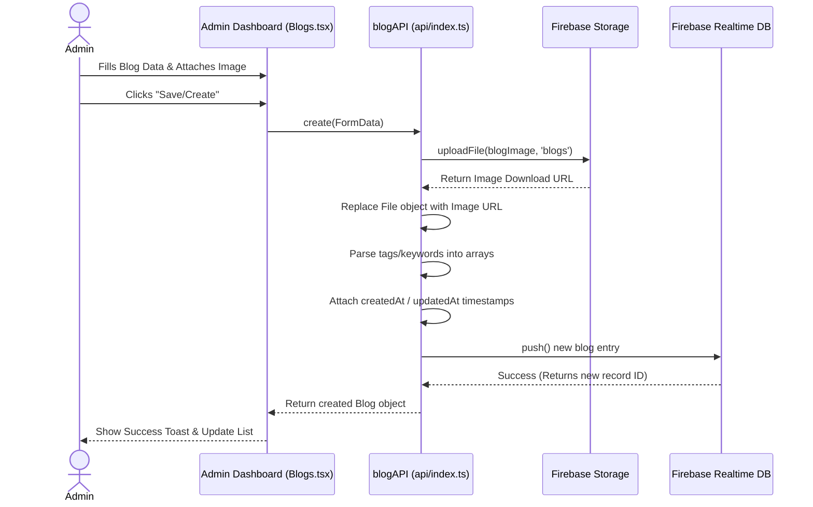
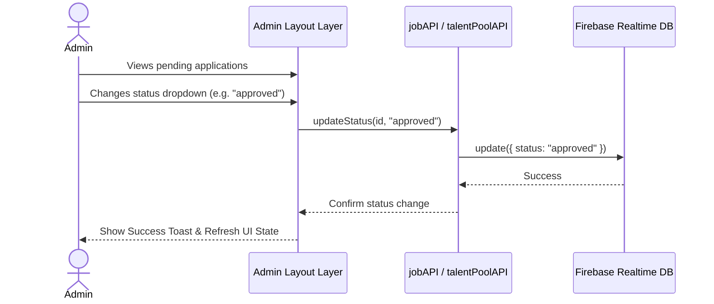

# TechTide Corporate LLP - Sequence Diagrams

These diagrams map out the core interactions and data flow within the application. They are written using [Mermaid syntax](https://mermaid.js.org/).

## 1. Authentication & Role Assignment Flow
How users and admins authenticate and receive their respective roles from Firebase.

## 2. Client Submission Flow (e.g., Booking an Appointment)
How a visitor submits data (like booking an appointment) and how the system processes it without a backend server.

## 3. Admin Content Management Flow (Creating a Blog/Team Member)
How an admin creates content and how images/files are handled prior to saving records to the database.

## 4. Admin Action Flow (Updating Job / Partner Statuses)
How an admin reviews submissions and updates statuses (e.g. moving a job application from `pending` to `approved`).

